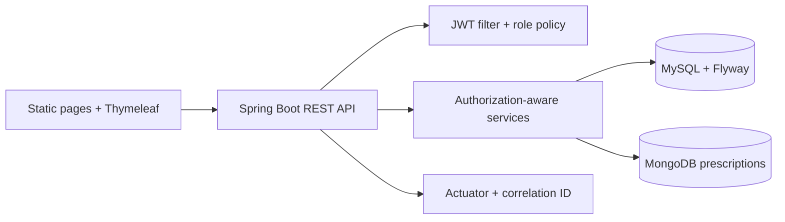
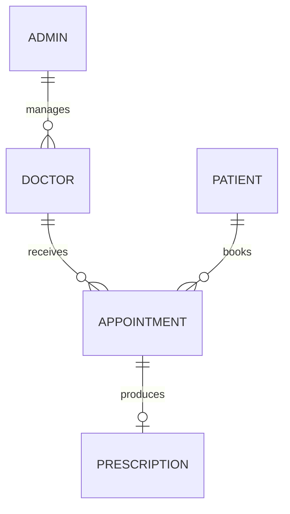

# Smart Clinic Spring Boot Portfolio

Smart Clinic is a small clinic-management backend and browser demo. It turns the original Coursera Java capstone into a portfolio project that demonstrates authentication, authorization, relational/document persistence, API contracts, and reproducible delivery.

## Product problem

Clinics need one workflow for finding doctors, booking visits, and recording prescriptions without exposing another patient's data. The application supports three roles:

- `ADMIN` manages the doctor directory.
- `DOCTOR` sees assigned appointments and records prescriptions.
- `PATIENT` manages their profile and own appointments.

## Portfolio capabilities

- Spring Security stateless JWT authentication with BCrypt password hashes.
- Role and ownership checks in the service layer, not only in controllers.
- DTO validation and RFC 9457 `ProblemDetail` errors.
- Flyway-managed MySQL schema, procedures, and safe local demo data.
- MongoDB prescription documents linked to MySQL appointments.
- Paginated/filterable doctor directory.
- OpenAPI 3 contract and Swagger UI for local/demo use; both are disabled in the cloud profile.
- Actuator health, liveness, readiness, and correlation IDs.
- Unit, MVC, Testcontainers integration, JavaScript, HTML, CSS, Checkstyle, and Hadolint checks.

## Stack and architecture

Java 17, Spring Boot 3.4.4, Spring MVC, Spring Security, Spring Data JPA, Flyway, MySQL 8.4, Spring Data MongoDB, MongoDB 7, Thymeleaf/static HTML, Maven, Node.js, Docker Compose, and GitHub Actions.





The request/data flow and module responsibilities are documented in [`docs/architecture.md`](docs/architecture.md).

## Run locally for free

Requirements: Docker Desktop, Git, and (for non-container commands) Java 17 and Node.js 20+.

PowerShell:

```powershell
Copy-Item .env.example .env
docker compose up --build --wait
```

Bash:

```bash
cp .env.example .env
docker compose up --build --wait
```

The application is then available at `http://localhost:8080`. Compose starts MySQL, MongoDB, and the application; health checks wait for all dependencies. Stop it with `docker compose down` (add `--volumes` when you intentionally want a fresh database).

The committed `.env.example` values are local-only demo values. Replace every value before any shared or cloud deployment, and never commit `.env`.

## Safe local demo accounts

The `demo` profile seeds accounts with BCrypt hashes. The public local password is `password` only for this disposable demo database:

| Role | Username/email |
| --- | --- |
| Admin | `admin` |
| Doctor | `dr.adams@example.com` |
| Patient | `jane.doe@example.com` |

Use a clean local volume when repeating the demo. Do not use these credentials for real data.

## Demo workflow

1. Open the landing page and sign in to the Admin portal.
2. Create a doctor with AM/PM availability.
3. Open the Patient portal, register/sign in, filter the doctor directory, and book a future slot.
4. Sign in to the Doctor portal, view the assigned appointment, and create a prescription.
5. Use Swagger UI locally to inspect the same bearer-authenticated contract. It is disabled in the cloud profile.

## API contract

Modern routes accept `Authorization: Bearer <JWT>` headers; tokens are not part of URLs. Copy-ready requests are in [`docs/api-examples.md`](docs/api-examples.md).

| Area | Routes |
| --- | --- |
| Auth | `POST /api/auth/admin/login`, `/api/auth/doctors/login`, `/api/auth/patients/login` |
| Patients | `POST /api/patients`, `GET /api/patients/me` |
| Doctors | `GET /api/doctors`, admin `POST/PUT/DELETE /api/doctors...` |
| Appointments | `GET/POST /api/appointments`, patient `PUT/DELETE /api/appointments/{id}` |
| Prescriptions | doctor `POST /api/prescriptions`, doctor/patient `GET /api/prescriptions/{appointmentId}` |

`ProblemDetail` responses consistently carry status, title, detail, instance, timestamp, and validation-field errors where applicable.

## Verification commands

```powershell
Set-Location app
.\mvnw.cmd clean verify       # unit/MVC, Checkstyle, JaCoCo >= 70%; IT needs Docker
Set-Location ..
npm ci
npm run verify:frontend       # ESLint, HTMLHint, Stylelint, node:test
docker build --file app/Dockerfile --tag smart-clinic:local app
```

Local/demo runtime endpoints:

- Swagger UI: `http://localhost:8080/swagger-ui.html`
- OpenAPI JSON: `http://localhost:8080/v3/api-docs`
- Liveness: `http://localhost:8080/actuator/health/liveness`
- Readiness: `http://localhost:8080/actuator/health/readiness`

Latest verified checks: Java unit/MVC suite 93/93; frontend lint/tests 8/8; `MongoPrescriptionIT` 3/3; `MySqlMigrationIT` 2/2; and `PrescriptionCrossStoreIT` 4/4. `SmartClinicApiIT` was not completed on this Windows/JDK host because its Testcontainers application process could not bind its loopback listener (ENV-001); it is not reported as passing.

## Security decisions and trade-offs

- Passwords are BCrypt encoded at registration/seed time and excluded from response DTOs.
- JWTs carry account ID, subject, role, issued-at, and expiry; the signing secret is environment-backed and must be at least 32 UTF-8 bytes.
- Sessions, form login, and HTTP Basic are disabled for the API; the filter chain is stateless.
- Ownership is rechecked against persisted appointment relationships for every patient/doctor operation.
- Prescriptions live in MongoDB while appointments/status live in MySQL. There is no cross-database atomic transaction: creation writes MongoDB first and then completes the appointment. A new request returns `201`; an identical retry returns `200` and repairs a missing completion update; reuse of an appointment ID with different prescription content returns `409`.
- Legacy controller mappings have been removed. The frontend and protected API calls use bearer headers; tokens are never accepted in URLs.

## Free deployment

The intended zero-cost topology is Render Free (Docker web service) + Aiven Free MySQL + MongoDB Atlas M0. The `cloud` profile requires separate runtime and Flyway database identities, plus cloud-only environment values validated at startup. Provider accounts, network allowlists, secret entry, deployment, and identity bootstrap remain user-controlled and were not performed in this repository run. See [`render.yaml`](render.yaml) and [`docs/deployment/free-tier-runbook.md`](docs/deployment/free-tier-runbook.md) for the setup sequence and limitations.

Free tiers can sleep, cold-start, have small storage/connection limits, and are not a production SLA. No healthcare-compliance claim is made, and only synthetic demo data belongs here.

## Evidence and screenshots

The original assignment answers and SQL artifacts remain in [`ASSIGNMENT-ANSWERS.md`](ASSIGNMENT-ANSWERS.md), [`database/`](database), and Git history. Screenshot names and capture rules are listed in [`docs/screenshots/README.md`](docs/screenshots/README.md); no screenshots are claimed until they are actually captured and redacted.
