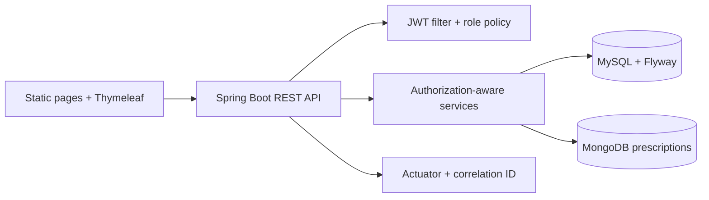
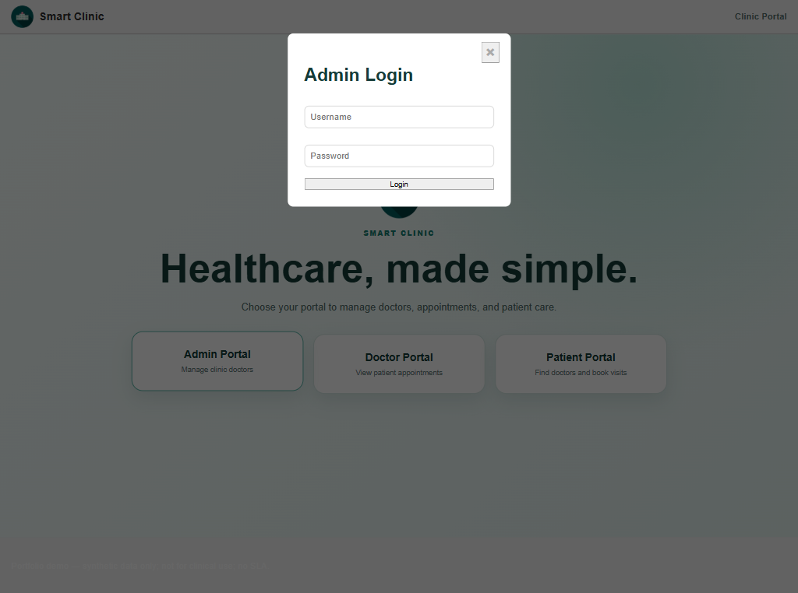
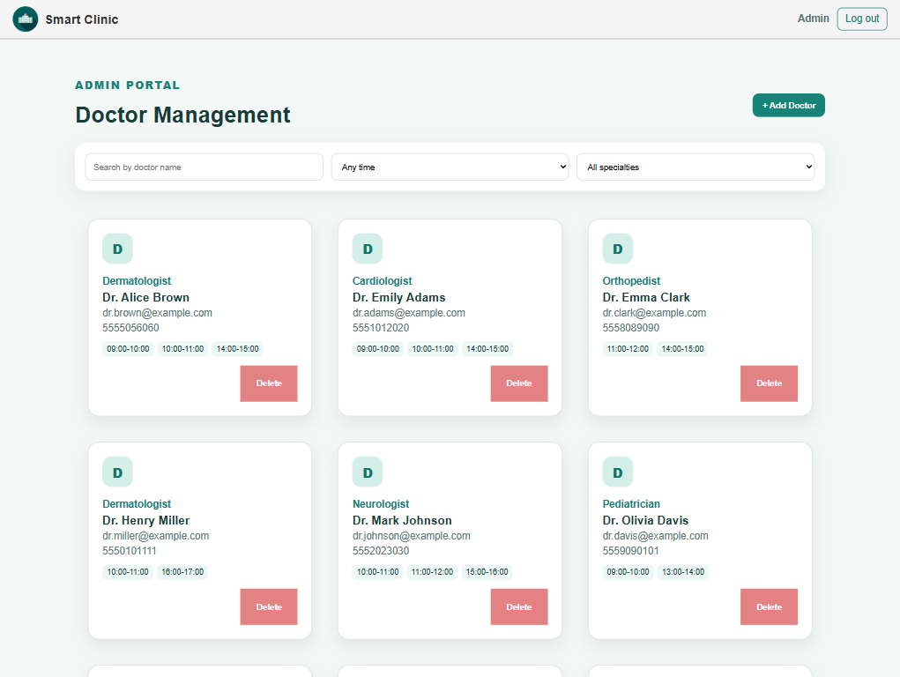
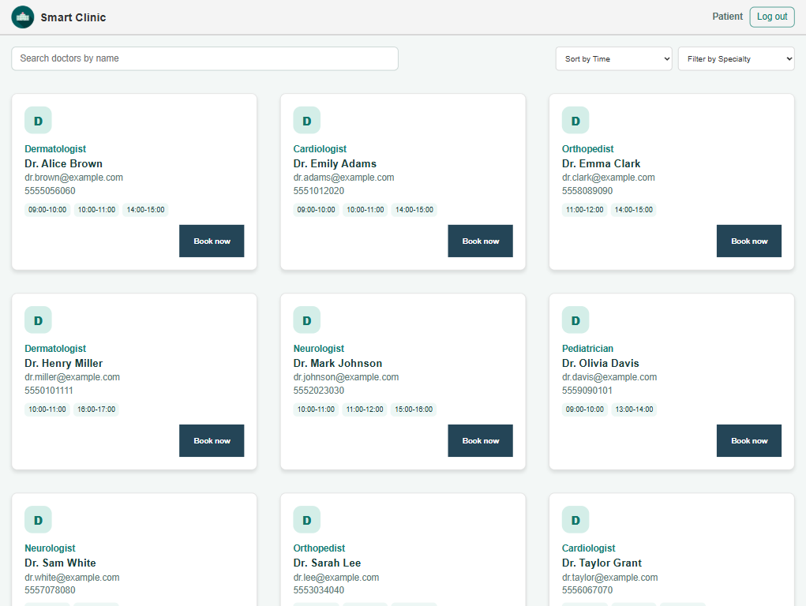
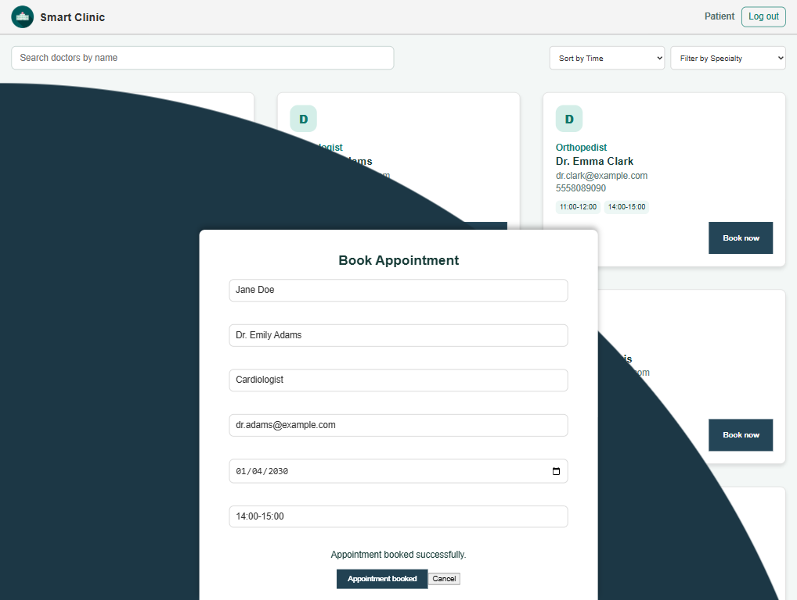
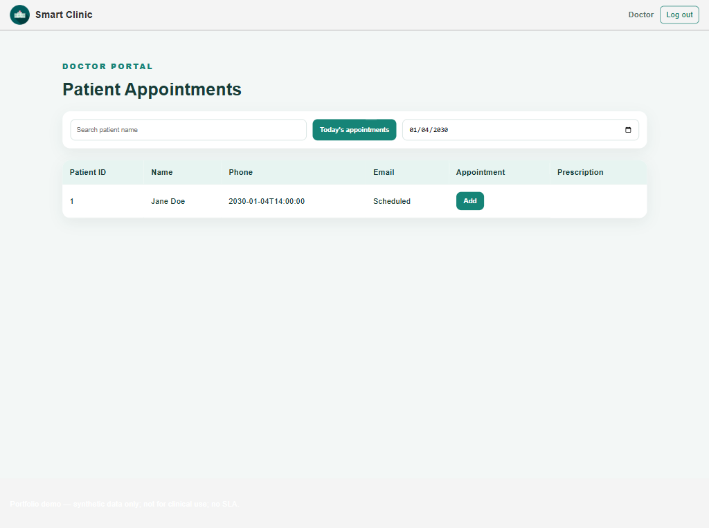
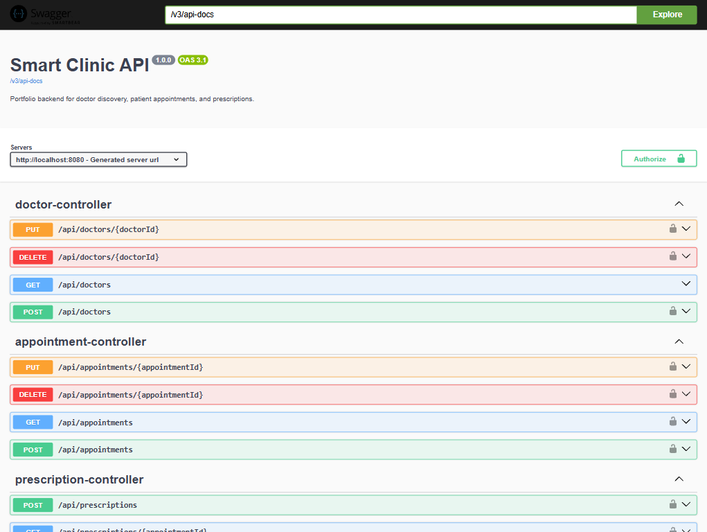
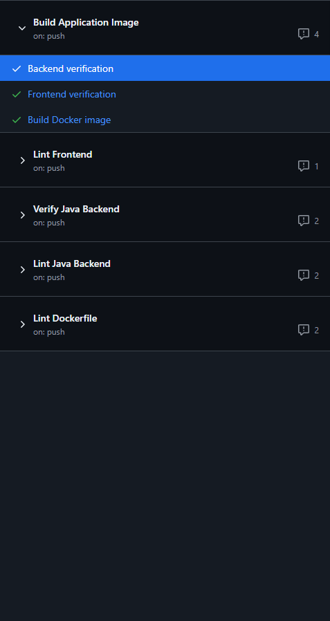

# Smart Clinic Spring Boot Portfolio

Smart Clinic is a Spring Boot clinic-management portfolio project with a browser demo. It extends a Coursera Java capstone into a demonstrable backend application; it is course and portfolio evidence, not commercial healthcare experience.

## What this repository demonstrates

| Java backend capability | Repository evidence |
| --- | --- |
| Spring Boot REST APIs | Controllers and API examples in [`app/`](app) and [`docs/api-examples.md`](docs/api-examples.md) |
| Authentication and role flows | Stateless JWT authentication, BCrypt password hashing, role and ownership checks for Admin, Doctor, and Patient |
| Relational persistence | Spring Data JPA, MySQL 8.4, and Flyway migrations/procedures |
| Document persistence | MongoDB prescription documents linked to MySQL appointments |
| API contract and errors | OpenAPI/Swagger UI for local demo use and RFC 9457 `ProblemDetail` responses |
| Testing and delivery checks | Maven unit/MVC and Testcontainers tests, frontend lint/tests, Docker image build, GitHub Actions |
| Release and cloud readiness | [`docs/deployment/release-readiness.md`](docs/deployment/release-readiness.md) and [`cloud/README.md`](cloud/README.md) |

No Camunda workflow or Domain-Driven Design implementation is claimed.

## Course baseline and portfolio upgrades

The Coursera/IBM lab baseline supplies Java packaged-application context, assignment answers, and SQL artifacts. Those source materials remain in [`ASSIGNMENT-ANSWERS.md`](ASSIGNMENT-ANSWERS.md), [`database/`](database), and Git history.

Portfolio work in this repository adds authenticated role flows, DTO validation, authorization-aware services, MySQL/Flyway and MongoDB integration, an OpenAPI contract, health/readiness endpoints, Docker Compose, automated checks, release-readiness guidance, and a browser-based demo. These are repository artifacts, not claims about prior employment.

## Stack and architecture

Java 17, Spring Boot 3.4.4, Spring MVC, Spring Security, Spring Data JPA, Flyway, MySQL 8.4, Spring Data MongoDB, MongoDB 7, Thymeleaf/static HTML, Maven, Node.js, Docker Compose, and GitHub Actions.



The request/data flow and module responsibilities are in [`docs/architecture.md`](docs/architecture.md).

## Run local demo

Requirements: Docker Desktop and Git. Java 17 and Node.js 20+ are needed for non-container verification commands.

```powershell
Copy-Item .env.example .env
docker compose up --build --wait
```

Open `http://localhost:8080` when Compose reports healthy. Committed `.env.example` values are disposable local-demo values; never use them for shared or cloud deployment, and never commit `.env`.

On this Windows host, an isolated local run passed after a first-start Flyway/MySQL connection race. If readiness does not converge on first start, wait until MySQL is healthy, then recreate only application service:

```powershell
docker compose up --build --wait app
```

This recovery preserves database volumes. Use `docker compose down` to stop stack; add `--volumes` only when intentionally starting with empty local data.

### Safe demo accounts

`demo` profile seeds disposable accounts. Password `password` is public only for this local database.

| Role | Username/email |
| --- | --- |
| Admin | `admin` |
| Doctor | `dr.adams@example.com` |
| Patient | `jane.doe@example.com` |

Do not use these accounts or values with real data.

## Interviewer walkthrough

1. Open landing page and sign in to Admin portal.
2. Create or inspect doctor with AM/PM availability.
3. Use Patient portal to register/sign in, filter doctors, and book future slot.
4. Use Doctor portal to view appointment and submit prescription.
5. Inspect bearer-authenticated API routes in local Swagger UI.

Independent runtime verification observed persistent prescription-submit success with synthetic data. Swagger UI is intentionally disabled in cloud profile.

## API and operational endpoints

Copy-ready authenticated requests are in [`docs/api-examples.md`](docs/api-examples.md). Modern routes use `Authorization: Bearer <JWT>` headers; tokens are never accepted in URLs.

| Area | Routes |
| --- | --- |
| Auth | `POST /api/auth/admin/login`, `/api/auth/doctors/login`, `/api/auth/patients/login` |
| Patients | `POST /api/patients`, `GET /api/patients/me` |
| Doctors | `GET /api/doctors`, admin `POST/PUT/DELETE /api/doctors...` |
| Appointments | `GET/POST /api/appointments`, patient `PUT/DELETE /api/appointments/{id}` |
| Prescriptions | doctor `POST /api/prescriptions`, doctor/patient `GET /api/prescriptions/{appointmentId}` |

Local/demo endpoints: `http://localhost:8080/swagger-ui.html`, `/v3/api-docs`, `/actuator/health/liveness`, and `/actuator/health/readiness`.

## Verification evidence

Latest reviewed evidence includes healthy isolated Compose stack and readiness endpoint, synthetic guest/admin/patient/doctor browser journey, prescription submission, Swagger rendering, frontend lint plus 16 frontend tests, and post-merge GitHub Actions checks for backend verification, frontend verification, Docker image build, and frontend lint.

Focused Testcontainers reports in this checkout show `MongoPrescriptionIT` (3 tests), `MySqlMigrationIT` (2 tests), and `PrescriptionCrossStoreIT` (4 tests) passing. `SmartClinicApiIT` remains unverified on this Windows/JDK host because its Testcontainers application process could not bind loopback listener (ENV-001); it is not claimed as passing.

Run available checks locally:

```powershell
Set-Location app
.\mvnw.cmd clean verify       # unit/MVC, Checkstyle, JaCoCo; IT needs Docker
Set-Location ..
npm ci
npm run verify:frontend       # ESLint, HTMLHint, Stylelint, node:test
docker build --file app/Dockerfile --tag smart-clinic:local app
```

## Screenshot evidence

All images below are real local-demo or GitHub Actions captures, visually reviewed and sanitized. They use synthetic demo data only. Full capture inventory and redaction policy: [`docs/screenshots/README.md`](docs/screenshots/README.md).

| Evidence | Capture |
| --- | --- |
| Landing and login | [landing-login.png](docs/screenshots/landing-login.png) |
| Admin dashboard | [admin-dashboard.png](docs/screenshots/admin-dashboard.png) |
| Doctor search | [doctor-search.png](docs/screenshots/doctor-search.png) |
| Patient appointment booking | [appointment-flow.png](docs/screenshots/appointment-flow.png) |
| Doctor Portal scheduled-appointment table | [doctor-dashboard.png](docs/screenshots/doctor-dashboard.png) |
| Local OpenAPI/Swagger UI | [swagger-ui.png](docs/screenshots/swagger-ui.png) |
| Post-merge GitHub Actions checks | [github-actions.png](docs/screenshots/github-actions.png) |

<p>
  <a href="docs/screenshots/landing-login.png"></a>
  <a href="docs/screenshots/admin-dashboard.png"></a>
  <a href="docs/screenshots/doctor-search.png"></a>
  <a href="docs/screenshots/appointment-flow.png"></a>
  <a href="docs/screenshots/doctor-dashboard.png"></a>
  <a href="docs/screenshots/swagger-ui.png"></a>
  <a href="docs/screenshots/github-actions.png"></a>
</p>

## Cloud deployment: optional, not performed

Original Coursera lab uses IBM Skills Network, Docker, and GitHub Actions; it does not require public-cloud deployment. Repository includes optional, user-operated cloud guide for Render Free + Aiven Free MySQL + MongoDB Atlas Free: [`cloud/README.md`](cloud/README.md).

No provider account, secret, network rule, cloud identity, live URL, or public deployment was created or validated in this run. Guide is for synthetic demo data only and makes no production, SLA, or healthcare-compliance claim.

## Security decisions and limits

- Passwords are BCrypt encoded and excluded from response DTOs.
- JWTs are environment-backed; cloud value must be at least 32 UTF-8 bytes.
- API sessions, form login, and HTTP Basic are disabled; authorization is rechecked against persisted appointment relationships.
- Prescriptions are stored in MongoDB while appointment status is stored in MySQL, so no cross-database atomic transaction exists. Retry behavior and conflict handling are tested in `PrescriptionCrossStoreIT`.
- Application is synthetic-data portfolio demo. It is not production healthcare deployment.
