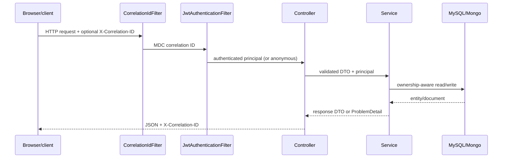

# Smart Clinic architecture

## Module responsibilities

| Module | Responsibility |
| --- | --- |
| `controllers` | HTTP routes, validation, principal extraction, status codes |
| `services` | Role checks, ownership rules, slot conflicts, transaction boundaries |
| `repo` | Spring Data JPA/Mongo persistence interfaces |
| `DTO` + `mappers` | Stable request/response contract; no password or entity graph leakage |
| `security` | Bearer JWT parsing and `ROLE_*` authorities |
| `observability` | Correlation ID response header and MDC lifecycle |
| `db/migration` | Local/demo schema and seed migrations |
| `db/cloud-migration` + `db/common-migration` | Cloud schema/procedure migrations without demo rows |
| `static` + `templates` | Browser demo using same-origin API calls and bearer headers |

## Request flow

## Cross-database prescription flow

Appointments are relational because slot uniqueness and patient/doctor ownership are relational concerns. Prescription documents are stored in MongoDB and reference the appointment ID. Creation verifies doctor ownership, writes MongoDB, then marks the MySQL appointment completed. The two stores cannot commit atomically, so the MongoDB `appointmentId` has a unique index and retry is the recovery boundary: a new request returns `201`, an identical request returns `200` and retries the MySQL completion update, and different content for the same appointment returns `409`. If MongoDB cannot write, the appointment remains incomplete; if the completion update fails after MongoDB succeeds, the next identical request repairs it.

## Cloud profile boundary

`SPRING_PROFILES_ACTIVE=cloud` uses migration locations that exclude demo rows, disables OpenAPI/Swagger endpoints, and requires a dedicated Flyway database identity distinct from the runtime identity. Startup rejects missing, local/demo, or invalid cloud values, including wildcard or local CORS origins. The repository provides deployment configuration only: no cloud provider account, deployment, or cloud identity bootstrap is performed here.
