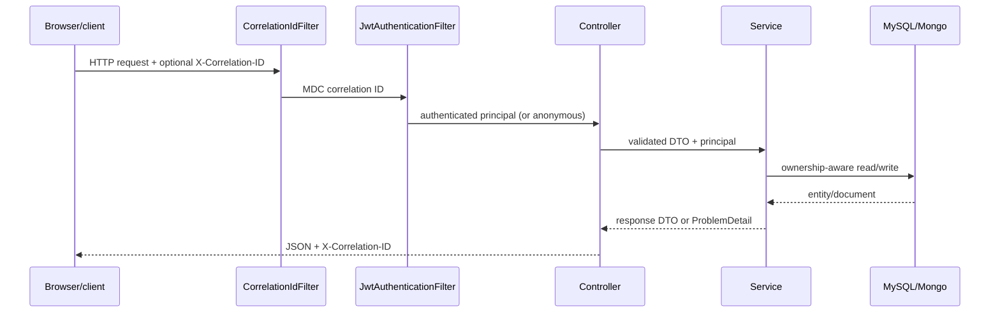

# Smart Clinic architecture

## Module responsibilities

| Module | Responsibility |
| --- | --- |
| `controllers` | HTTP routes, validation, principal extraction, status codes |
| `services` | Role checks, ownership rules, slot conflicts, transaction boundaries |
| `repo` | Spring Data JPA/Mongo persistence interfaces |
| `DTO` + `mappers` | Stable request/response contract; no password or entity graph leakage |
| `security` | Bearer JWT parsing and `ROLE_*` authorities |
| `observability` | Correlation ID response header and MDC lifecycle |
| `db/migration` | Ordered MySQL schema, procedures, and hashed demo seed |
| `static` + `templates` | Browser demo using same-origin API calls and bearer headers |

## Request flow

## Cross-database prescription flow

Appointments are relational because slot uniqueness and patient/doctor ownership are relational concerns. Prescription documents are stored in MongoDB and reference the appointment ID. Creation verifies doctor ownership, rejects an existing appointment prescription, writes MongoDB, then marks the MySQL appointment completed. The two stores cannot commit atomically; the duplicate check makes a retry idempotent and the trade-off is explicit in the service JavaDoc and README.
