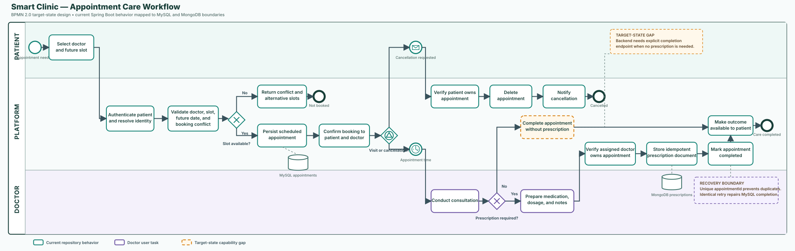

# Smart Clinic BPMN design

This folder contains a BPMN 2.0 design for the appointment-to-care lifecycle. It is a portfolio design artifact, not a claim that Camunda or another process engine currently runs inside Smart Clinic.

- [Editable BPMN 2.0 model](appointment-care-workflow.bpmn)
- [Portfolio SVG](appointment-care-workflow.svg)

## Process scope

The process begins when a patient chooses a doctor and future slot. Smart Clinic authenticates the patient, validates doctor availability and slot conflicts, and persists a scheduled appointment in MySQL. After confirmation, an event-based gateway waits for either cancellation or appointment time.

At appointment time, the doctor conducts the consultation. If medication is required, Smart Clinic verifies that the authenticated doctor owns the appointment, writes one prescription document per `appointmentId` to MongoDB, and marks the MySQL appointment completed. The patient can then read the outcome.

## Decision and event model

| BPMN element | Decision or event |
| --- | --- |
| Exclusive gateway: `Slot available?` | Rejects past, unsupported, or already-booked slots with a conflict response. |
| Event-based gateway: `Visit or cancellation?` | Waits for the appointment timer or a patient cancellation message. Only the first event continues. |
| Exclusive gateway: `Prescription required?` | Routes to prescription capture or direct appointment completion. |
| MongoDB recovery annotation | An identical prescription retry is safe because `appointmentId` is unique. The retry repairs a failed MySQL completion update. |

## Repository mapping

| BPMN activity | Current repository evidence |
| --- | --- |
| Authenticate patient | Stateless JWT authentication and persisted patient identity. |
| Validate availability | `AppointmentService.validateSlot` and `ensureSlotFree`. |
| Persist or cancel appointment | Patient-owned MySQL appointment operations in `AppointmentService`. |
| Verify assigned doctor | `PrescriptionService.verifyDoctorOwnership`. |
| Store prescription | MongoDB `PrescriptionRepository`, keyed by appointment ID. |
| Complete appointment | MySQL status update after prescription persistence. |
| Retry recovery | `PrescriptionService.existingResult` retries completion for identical content and rejects conflicting content. |

## Target-state gap

The no-prescription branch is intentionally highlighted in amber. Current code completes an appointment when a prescription is created; it does not expose a dedicated doctor-authorized command for completing a consultation without a prescription. Implement that command before treating this model as executable application behavior.

## Candidate workflow variables

| Variable | Type | Purpose |
| --- | --- | --- |
| `appointmentId` | `long` | Correlates MySQL appointment and MongoDB prescription. |
| `patientId` | `long` | Ownership check for booking, update, and cancellation. |
| `doctorId` | `long` | Doctor assignment and prescription authorization. |
| `appointmentTime` | ISO-8601 date-time | Timer and future-slot validation. |
| `slotAvailable` | `boolean` | Output of slot validation. |
| `prescriptionRequired` | `boolean` | Consultation outcome gateway. |
| `medication`, `dosage`, `doctorNotes` | strings | Prescription payload when required. |

## Camunda implementation boundary

The `.bpmn` file is marked `isExecutable="false"`. Before execution, choose Camunda 7 or Camunda 8, define worker/job types, configure user-task identity, add bounded retries and incidents, and design message correlation for cancellation. Do not place JWTs, passwords, patient health data, or provider credentials in workflow variables or history for this synthetic portfolio demo.
